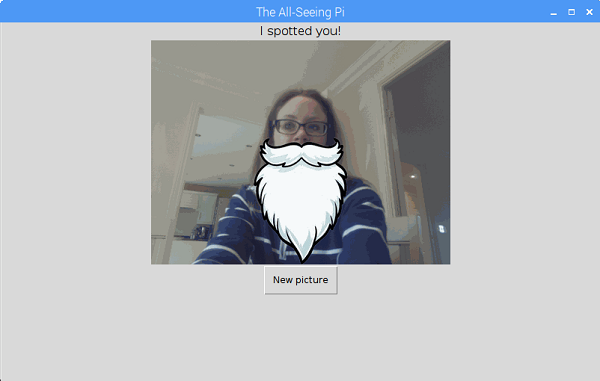

## Display the picture

You probably don't want your photo booth participants to have to go digging through the Raspbian filesystem to see the picture they took either, so let's display the picture they took on the GUI.

- Locate the line of code where you intialise the `output` variable:

    ```python
    output = ""
    ```

    Immediately underneath it, add a new line of code to define the location where we will store the `latest-photo`, i.e. the photo most recently taken using the booth.

    ```python
    latest_photo = '/home/pi/allseeingpi/latest.gif'
    ```
- Now locate the line of code where you added the `PushButton` to your GUI. Immediately **before** that line, insert a line of code to display an image on the GUI:

    ```
    your_pic = Picture(app, latest_photo)
    ```

- The file we are referring to, `latest.gif`, does not yet exist, so if you run your program now you will not see a photograph displayed on the GUI. We must add code inside the `take_picture()` function to generate this image so that it can be displayed. Locate the `take_picture()` function and, underneath the other code in the function, add the following lines (remembering to ensure that the new lines of code are also indented):

    ```python
    size = 400, 400
    gif_img = Image.open(output)
    gif_img.thumbnail(size, Image.ANTIALIAS)
    gif_img.save(latest_photo, 'gif')

    your_pic.set(latest_photo)
    ```

    This code opens the `output` image (the image containing the photo combined with the overlay), creates a smaller thumbnail of that image in **gif** format, and saves it at the location set up in `latest_photo`. It then sets the image on the GUI (`your_pic`) to be that latest photo image using the `set()` function which is part of the guizero library.

- Save your code and test whether, when you take a photograph, it is displayed on the GUI. You may find that there is a short delay between the camera preview exiting and the image displaying on the GUI while it is saving.

    

    You may notice that the picture quality of the image displayed on screen is not optimal. This is because the picture has been converted to gif format to be displayed on the GUI. The full-quality png version of the photograph will still be saved in the `allseeingpi` folder.

